# Food Classification

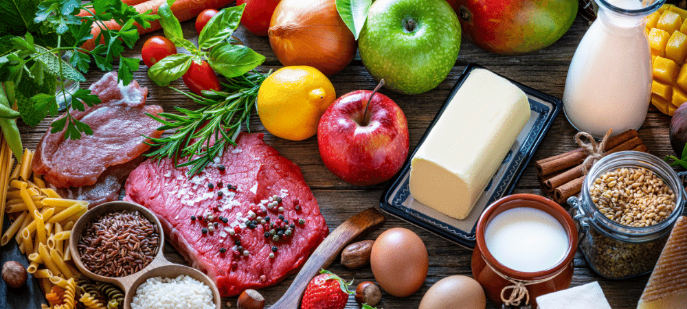

## Problem Description

Food classification plays a crucial role in various applications, from dietary monitoring to restaurant menu analysis. The challenge lies in accurately categorizing diverse food items into specific groups. This project aims to address the following challenges:

1. **Diverse Food Categories:** The dataset encompasses a wide range of food categories, each with its own unique visual characteristics, making accurate classification challenging.

2. **Limited Data Availability:** In some categories, obtaining a sufficient amount of labeled data for training can be a hurdle, leading to potential biases and performance issues.

3. **Model Generalization:** Achieving a model that generalizes well across different food types and variations is a key objective, considering the practical application of food classification in various scenarios.

### Dataset Overview

This dataset contains 16,643 food images grouped into 11 major food categories: **Bread, Dairy product, Dessert, Egg, Fried food, Meat, Noodles-Pasta, Rice, Seafood, Soup, Vegetable-Fruit**.

The dataset is divided into three splits: **evaluation, training, and validation**, and each split includes images of the 11 food categories.

### Dataset Resource

For more details and to access the dataset, you can visit [Dataset Resource](https://www.kaggle.com/datasets/trolukovich/food11-image-dataset/data).

**Notes:**
I performed the model training processes of this project with [Saturn Cloud](https://saturncloud.io/).
Additionally, the notebook [food-classification-model-training.ipynb](https://github.com/murattkiran/food-classification/blob/main/food-classification-model-training.ipynb) contains all the training processes for the food classification model.

## 1. EDA (Exploratory Data Analysis)

The dataset consists of sample images as shown below:
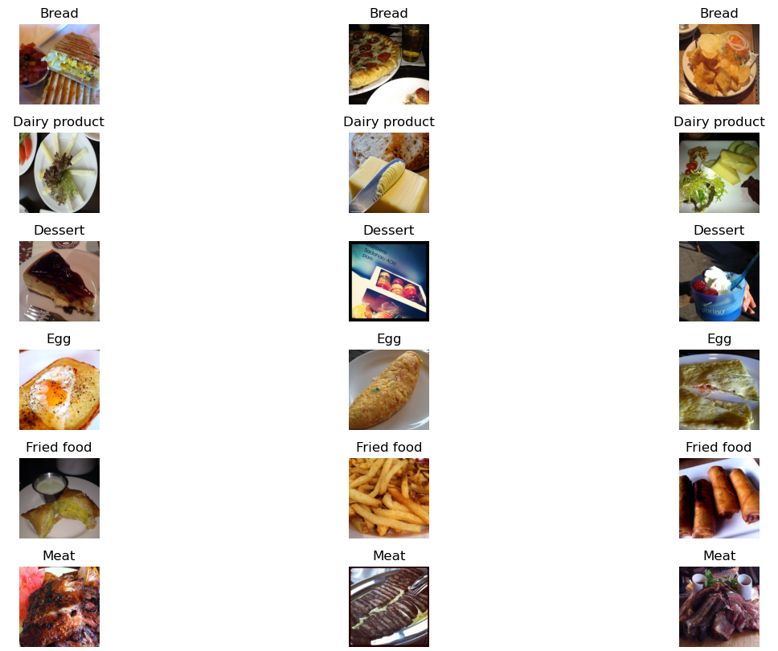 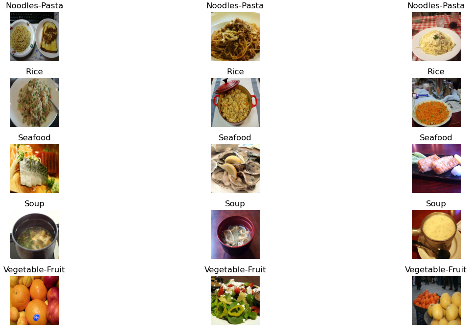

### Loading an Image

You can use the following Python code to load an image from the dataset and convert it into a numpy array of a 3D shape. Each row of the array represents the values of the red, green, and blue color channels of one pixel in the image:

```python
import numpy as np
from tensorflow.keras.preprocessing.image import load_img

# Set the path, name, and full name of the image
path = "./training/Dessert"
name = "100.jpg"
fullname = f"{path}/{name}"

# Load the image and convert it into a numpy array
img = load_img(fullname, target_size=(299, 299))
x = np.array(img)

# Print the shape of the numpy array
print("Image Shape:", x.shape)
```

## 2. Pre-trained Convolutional Neural Networks

In this section, pre-trained convolutional neural networks have been utilized for our food classification. The Keras applications offer different pre-trained models with various architectures. The model [Xception](https://keras.io/api/applications/xception/) has been employed for this project. This model takes an input image size of `(229, 229)` and scales each image pixel between `-1` and `1`.

```python
# Create an instance of the pre-trained Xception model
model = Xception(weights='imagenet', input_shape=(229, 229, 3))
```
```python
X = np.array([x])
X.shape # Output: (1, 299, 299, 3)
X = preprocess_input(X)
pred = model.predict(X)
pred.shape # Output: (1, 1000)
decode_predictions(pred)

```
- Along with image size, the model also expects the `batch_size` which is the size of the batches of data (default 32). If one image is passed to the model, then the expected shape of the model should be (1, 229, 229, 3)
- The preprocess_input function was used on our data to make predictions, as shown in the statement: `X = preprocess_input(X)`
- The `pred = model.predict(X)` function returns 2D array of shape `(1, 1000)`, where 1000 is the probablity of the image classes. `decode_predictions(pred)` can be used to get the class names and their probabilities in readable format.

## 3. Transfer Learning

Following are the steps to create train/validation data for model:

```python
# Build image generator for training (takes preprocessing input function)
train_gen = ImageDataGenerator(preprocessing_function=preprocess_input)

# Load in train dataset into train generator
train_ds = train_gen.flow_from_directory('./training', # Train images directory
                                         target_size=(150,150), # resize images to train faster
                                         batch_size=32) # 32 images per batch

# Create image generator for validation
val_gen = ImageDataGenerator(preprocessing_function=preprocess_input)

# Load in image for validation
val_ds = val_gen.flow_from_directory('./validation', # Validation image directory
                                     target_size=(150,150),
                                     batch_size=32,
                                     shuffle=False) # False for validation
```

Following are the steps to build model from a pretrained model:

```python
# Build base model
base_model = Xception(weights='imagenet',
                      include_top=False, # to create custom dense layer
                      input_shape=(150,150,3))

# Freeze the convolutional base by preventing the weights being updated during training
base_model.trainable = False

# Define expected image shape as input
inputs = keras.Input(shape=(150,150,3))

# Feed inputs to the base model
base = base_model(inputs, training=False) # set False because the model contains BatchNormalization layer

# Convert matrices into vectors using pooling layer
vectors = keras.layers.GlobalAveragePooling2D()(base)

# Create dense layer of 11 classes
outputs = keras.layers.Dense(11)(vectors)

# Create model for training
model = keras.Model(inputs, outputs)
```
Following are the steps to instantiate optimizer and loss function:

```python
# Define learning rate
learning_rate = 0.01

# Create optimizer
optimizer = keras.optimizers.Adam(learning_rate=learning_rate)

# Define loss function
loss = keras.losses.CategoricalCrossentropy(from_logits=True) # to keep the raw output of dense layer without applying softmax

# Compile the model
model.compile(optimizer=optimizer,
              loss=loss,
              metrics=['accuracy']) # evaluation metric accuracy
```

The model is ready to train once it is defined and compiled:

```python
# Train the model, validate it with validation data, and save the training history
history = model.fit(train_ds, epochs=15, validation_data=val_ds)
```

## 4. Model Training and Tuning

### Adjusting the learning rate

```python
# Function to create model
def make_model(learning_rate=0.01):
    base_model = Xception(weights='imagenet',
                          include_top=False,
                          input_shape=(150,150,3))

    base_model.trainable = False
    
    #########################################
    
    inputs = keras.Input(shape=(150,150,3))
    base = base_model(inputs, training=False)
    vectors = keras.layers.GlobalAveragePooling2D()(base)
    outputs = keras.layers.Dense(11)(vectors)
    model = keras.Model(inputs, outputs)
    
    #########################################
    
    optimizer = keras.optimizers.Adam(learning_rate=learning_rate)
    loss = keras.losses.CategoricalCrossentropy(from_logits=True)

    # Compile the model
    model.compile(optimizer=optimizer,
                  loss=loss,
                  metrics=['accuracy'])
    
    return model
```
```python
# Dictionary to store history with different learning rates
scores = {}

for lr in [0.0001, 0.001, 0.01, 0.1]:
    print(f"learning rate: {lr}")

    model = make_model(learning_rate=lr)
    history = model.fit(train_ds, epochs=10, validation_data=val_ds)
    scores[lr] = history.history

    print()
    print()
```
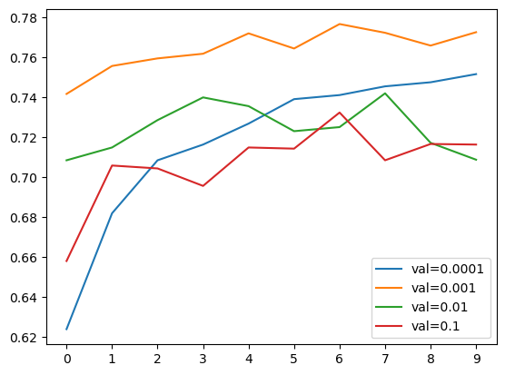
- **best learning_rate = 0.001**

`ModelCheckpoint` callback is used to save the best model during training.
```python
model.save_weights('model_v1.h5', save_format='h5')
checkpoint = keras.callbacks.ModelCheckpoint(
    'xception_v1_{epoch:02d}_{val_accuracy:.3f}.h5',
    save_best_only=True,
    monitor='val_accuracy',
    mode='max'
)
```

### Adding more layers

Add `size_inner` parameter and `inner = keras.layers.Dense(size_inner, activation='relu')(vectors)` to the make_model function.
Next, train the model with different sizes of inner layer:
```python
learning_rate = 0.001

scores = {}

for size in [10, 100, 1000]:
    print(f"size: {size}")

    model = make_model(learning_rate=learning_rate, size_inner=size)
    history = model.fit(train_ds, epochs=10, validation_data=val_ds)
    scores[size] = history.history

    print()
    print()
```
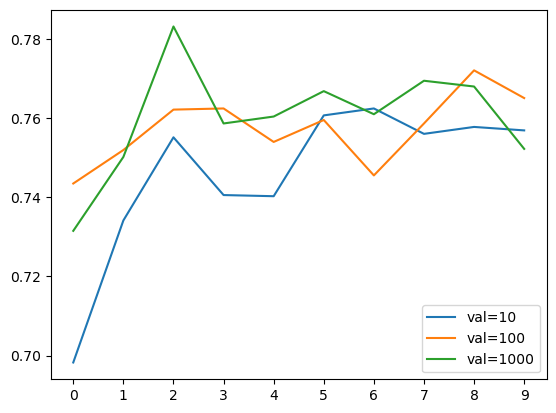
- **best size_inner = 1000** 

### Regularization and dropout

Add `droprate` parameter and `drop = keras.layers.Dropout(droprate)(inner)` to the make_model function.
```python
learning_rate = 0.001
size = 1000

scores = {}

for droprate in [0.0, 0.2, 0.5, 0.8]:
    print(f"droprate: {droprate}")

    model = make_model(
        learning_rate=learning_rate,
        size_inner=size,
        droprate=droprate
    )
    # Train for longer (epochs=30) cause of dropout regularization
    history = model.fit(train_ds, epochs=30, validation_data=val_ds)
    scores[droprate] = history.history

    print()
    print()
```
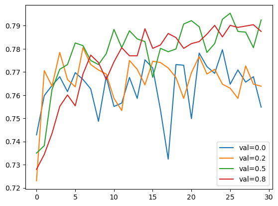
- **I'm go with droprate = 0.5**

### Data augmentation

**How to choose augmentations?**

- First step is to use our own judgement, for example, looking at the images (both on train and validation), does it make sense to introduce horizontal flip?
- Look at the dataset, what kind of vairations are there? are objects always center?
- Augmentations are hyperparameters: like many other hyperparameters, often times we need to test whether image augmentations are useful for the model or not. If the model doesn't improve or have same performance after certain epochs, in that case we don't use it.
```python
# Create image generator for train data and also augment the images
train_gen = ImageDataGenerator(
    preprocessing_function=preprocess_input,
    shear_range=10,
    zoom_range=0.1,
    vertical_flip=True
)

train_ds = train_gen.flow_from_directory(
    "./training",
    target_size=(150, 150),
    batch_size=32
)

val_gen = ImageDataGenerator(preprocessing_function=preprocess_input)
val_ds = val_gen.flow_from_directory(
    "./validation",
    target_size=(150, 150),
    batch_size=32,
    shuffle=False
)
```
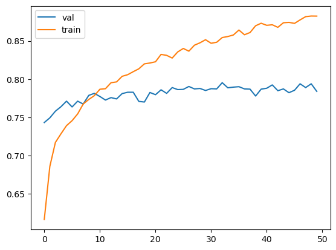
- **After the data augmentation process, no significant increase in accuracy values was observed. Therefore, there is no need for us to use the data augmentation process.**

## 5. Training a Larger Model

So far, all the experiments we conducted were carried out on a smaller model. The reason for this choice is that smaller models train faster, allowing us to iterate more quickly and experiment with different parameters. Now it's time to train a larger model with a size of `299x299`.
```python
checkpoint = keras.callbacks.ModelCheckpoint(
    'xception_v4_{epoch:02d}_{val_accuracy:.3f}.h5',
    save_best_only=True,
    monitor='val_accuracy',
    mode='max'
)
```
```python
learning_rate = 0.001
size = 1000
droprate = 0.5
input_size = 299

model = make_model(
    input_size=input_size,
    learning_rate=learning_rate,
    size_inner=size,
    droprate=droprate
)

history = model.fit(train_ds, epochs=50, validation_data=val_ds,
                   callbacks=[checkpoint])
```
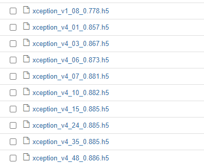
- best checkpoint = `xception_v4_48_0.886.h5`

## 6. Using the Model

- The saved model can be loaded and used for prediction with `keras.models.load_model(path/to/saved_model)` method.
- The model performance can be evaluated on test data with `model.evaluate(test_ds)`.
```python
model = keras.models.load_model('xception_v4_48_0.886.h5')
model.evaluate(test_ds)
```
- The prediction on the test image can be made using the method `model.predict(X)`.
```python
path = "./evaluation/Dessert/14.jpg"
img = load_img(path, target_size=(299, 299))
x = np.array(img) # converting img to numpy array
X = np.array([x])
X = preprocess_input(X)
pred = model.predict(X)
prediction_result = dict(zip(classes, pred[0]))
max_class = max(prediction_result, key=prediction_result.get)
print(f"The predicted class with the highest value: {max_class}") #The predicted class with the highest value: Dessert
```
**The prediction results of the model look quite successful.**

## 7. Convert Keras to TF-Lite

* tensorflow has a size of approximately 1.7 GB
* there are size limits of cloud services and docker container
* tensorflow lite is small in size and limited to using a model to make predictions (inference)
* convert tensorflow keras model to a tensorflow lite model

The conversion process from Keras to TF-Lite for the food classification model can be found in [tensorflow-model.ipynb](https://github.com/murattkiran/food-classification/blob/main/tensorflow-model.ipynb).

## 8. Preparing the Code for Lambda (Moving the code from notebook to script and testing it locally)

* Create `lambda_function.py`  for AWS Lambda
* Test the lambda function
* Open IPython in the terminal, import the `lambda_function`, and then use `lambda_function.predict("your url")` to make predictions. Replace "your url" with the URL you want to classify.
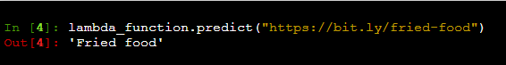
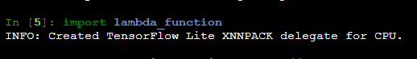
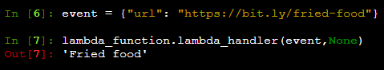

## 9. Web Service with Flask

* Create a file named `predict_flask.py`
* Open a terminal and run python `predict_flask.py` to start the server.
* Open another terminal and run python `test_flask.py`. If it displays the class of food, it indicates that the model and server are functioning.
* Use `Ctrl + c` to stop the server.

## 10. Virtual Environment

* To build a virtual environment, run `pip install pipenv`
* Install required packages with `pipenv install numpy pandas flask requests matplotlib tensorflow keras tflite_runtime keras_image_helper python-dotenv`
* Use `pipenv shell` to enter the virtual environment

## 11. Preparing a Docker Image

* Create a file named `Dockerfile` with the following content:
```Dockerfile
FROM public.ecr.aws/lambda/python:3.9

RUN pip install keras-image-helper

RUN pip install https://github.com/alexeygrigorev/tflite-aws-lambda/raw/main/tflite/tflite_runtime-2.7.0-cp39-cp39-linux_x86_64.whl

COPY xception_v4_48_0.886.tflite .
COPY lambda_function.py .

CMD ["lambda_function.lambda_handler"]  
```
* Build the Docker image using the following command:
```bash
docker build -t your_image_name .
```
- Replace `your_image_name` with a name of your choice.

* Now, we need to test it:
```bash
docker run -it --rm -p 8080:8080 your_image_name
```
* Now, let's test it:
Create a file named `test.py`
```python
import requests

url = 'http://localhost:8080/2015-03-31/functions/function/invocations'

data = {'url': 'https://bit.ly/fried-food'}

result = requests.post(url, json=data).json()
print(result)
```
* Open a terminal and run python `test.py`
